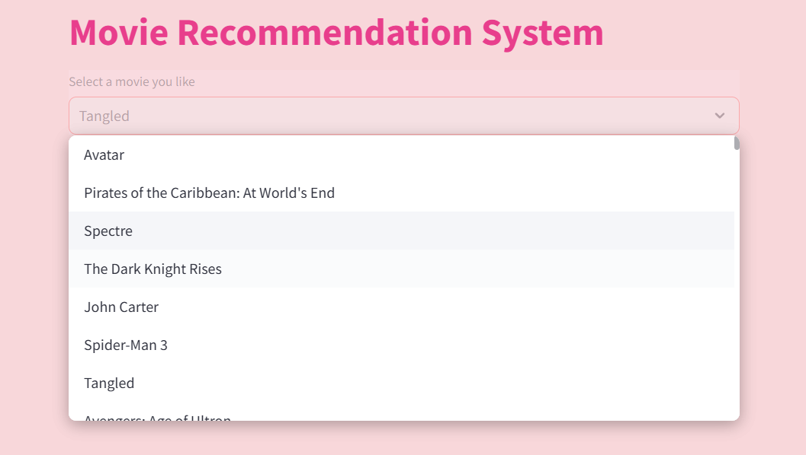
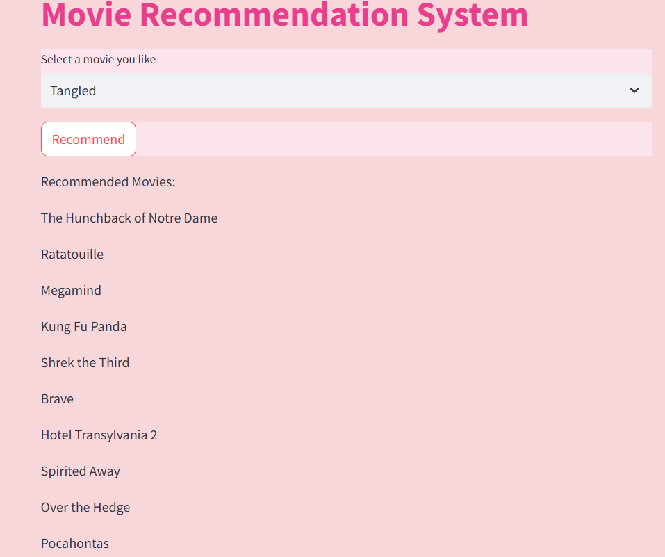

# Movie Recommendation System

This project implements a movie recommendation system using cosine similarity based on movie metadata.

# Overview
The movie recommendation system is designed to provide users with personalized movie recommendations based on their preferences and the similarity of movie features. It leverages movie metadata including genres, keywords, cast, and crew to suggest similar movies. The system calculates cosine similarity between movie tags to determine similarity and recommends movies based on user input.

# Libraries Explanation
# NumPy
- Description: Fundamental package for scientific computing with Python.
- Usage: Efficient array manipulation and mathematical operations.
# Pandas
- Description: Powerful library for data manipulation and analysis.
- Usage: Reading, cleaning, and preprocessing movie metadata.
# Seaborn
- Description: Statistical data visualization library based on Matplotlib.
- Usage: Helpful for visualizing data distributions and relationships.
# Scikit-learn
- Description: Machine learning library providing tools for data mining and analysis.
- Usage: Text vectorization (CountVectorizer) and computing cosine similarity.
# NLTK (Natural Language Toolkit)
- Description: Platform for building Python programs to work with human language data.
- Usage: Text preprocessing tasks like stemming.
# Requirements
Install the required libraries:
 - pip install -r requirements.txt
Run the main script to generate movie recommendations:
 -python app.py
Select  the title of a movie for which you want recommendations.
